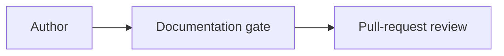

# Contributing documentation

Documentation is code. Change it on a non-default branch, review it in a pull
request, and validate it with the same pinned toolchain used by CI. A behavior
change is incomplete until its user, operator, reference, and troubleshooting
documentation is updated in the same pull request.

## Sources of truth

The version-controlled MkDocs content under `docs/` is authoritative. Keep the
repository `README.md` concise and link to the relevant documentation instead
of copying procedures into it. The files under `docs/help/` are concise offline
wizard help and deliberately remain usable when the site and cluster are
unavailable.

A GitHub Wiki, if enabled, is informal only. It may hold workshop notes,
experiments, or community tips, but it must link to the authoritative MkDocs
page and must not define supported behavior, compatibility, or operations. Move
durable knowledge into `docs/` through a reviewed pull request.

The [documentation architecture decision](../adr/0001-mkdocs-authoritative-documentation.md)
defines these boundaries and the publication safety model.

## Preview and validate locally

Create the documentation environment once:

```bash
python3 -m venv .venv
.venv/bin/python -m pip install --requirement requirements-docs.txt
```

Preview changes at the local URL printed by MkDocs:

```bash
.venv/bin/mkdocs serve
```

Before every push, run the exact same entry point as CI:

```bash
./scripts/validate-docs.sh
```

For Phase 3 Python work, also check the clone-and-run CLI wrapper directly when
you touch `fortifylab/` or `bin/fortifylab`:

```bash
./bin/fortifylab --help
python3 -m unittest tests.test_m1_entrypoints tests.test_m7_entrypoint_compatibility
```

The gate does not contact Kubernetes or require a Fortify license. It runs all
unit tests and a strict MkDocs build. The project validator also checks internal
links and anchors, navigation coverage, selected Markdown style rules,
terminology, common spelling mistakes, Mermaid fence structure, wizard
offline/online topic mappings, shell-example syntax, unsafe commands, tracked
secret-file patterns, and likely credential values. External links are not
fetched, keeping the result reproducible and usable offline.

Set `MKDOCS_BIN` when the pinned executable is in an isolated tool cache:

```bash
MKDOCS_BIN=/opt/docs-tools/bin/mkdocs ./scripts/validate-docs.sh
```

Do not replace this command with a locally convenient subset. If it fails, fix
the reported source rather than weakening the gate. A necessary narrow
exception belongs in the validator with regression coverage and reviewer
justification.

## Add or move a page

1. Choose the audience and the smallest authoritative section: getting
   started, Fortify concepts, deployment, operations, configuration,
   troubleshooting, safety, contributing, or architecture decisions.
2. Add one Markdown file with one H1 and descriptive headings. Keep one
   authoritative procedure and link to it from landing pages.
3. Add the page exactly once to `nav` in `mkdocs.yml`. The validation gate
   rejects missing pages, duplicate navigation targets, broken relative links,
   and missing anchors.
4. Link related pages in context. Use repository-relative Markdown links so
   preview, CI, and repository browsing all work.
5. If the route was public or used by the wizard, preserve compatibility as
   described below.

### Preserve routes and redirects

Treat a published path as a compatibility contract. Prefer leaving the file at
its existing path. If a move is necessary, keep a small compatibility page at
the old path that clearly links to the new canonical page, and add a regression
test for both paths. Do not use an unreviewed client-side redirect or silently
delete the old route. If a future redirect plugin is adopted, pin it in
`requirements-docs.txt`, configure the old-to-new mapping in version control,
and test the generated route.

Changing a heading can also break inbound anchor links. Preserve the heading
or update every repository link and wizard mapping in the same change.

## Maintain wizard help mappings

Wizard topic IDs in `scripts/lib/help.sh` are stable public contracts. They map
one topic to both a readable file in `docs/help/` and an online MkDocs route:

- `HELP_TOPIC_ID` contains stable, path-like IDs;
- `HELP_TOPIC_FILE` contains offline resources; and
- `HELP_TOPIC_ROUTE` contains site routes and optional anchors.

Keep the arrays aligned. During the Python CLI/TUI migration, also keep
`fortifylab.help` and the help catalog exposed through `fortifylab.runbooks` in
sync with those stable topic IDs. A new wizard step or troubleshooting outcome
needs an offline file mapping and an online route in the same change. Add or
update its call-site mapping, tests, and relevant long-form page. When replacing
a released topic ID, retain the old ID as an alias that resolves to the same
content; do not rename it in place. The gate rejects missing files, routes,
anchors, duplicate IDs, and incomplete arrays.

Offline help is intentionally brief. It should orient the user and point to a
safe next action; keep detailed procedures in MkDocs.

## Write diagrams

Use Mermaid when a relationship, dependency order, or workflow is materially
clearer as a diagram. Use a fenced `mermaid` block with a supported declaration
such as `flowchart` or `sequenceDiagram`:



Keep node IDs simple, label arrows when the meaning is not obvious, and include
nearby prose so the content remains understandable without the rendered
diagram. Avoid enormous diagrams and decorative visuals. Validation checks the
declaration and balanced delimiters; preview the site to check legibility in
both light and dark themes.

## Use consistent terminology and version claims

Use product names as they appear in the Fortify knowledge pages: **Software
Security Center (SSC)**, **ScanCentral SAST**, **ScanCentral DAST**, **License
and Infrastructure Manager (LIM)**, **Kubernetes Dashboard**, and **Fortify
Lab**. Define an abbreviation on first use, distinguish this lab automation
from Fortify product capabilities, and preserve the lab/demo-only boundary.

Do not present a version-sensitive claim from memory. Verify it against a
repository deployment value, tested profile, vendor documentation, or observed
command output. State the scope and date when the claim may age, cite the source
near the claim, and avoid words such as "latest" unless they are dynamically
true. A version bump must update every affected command, compatibility table,
example, and limitation in the same pull request. Record an unverified value as
a limitation, not a guarantee.

## Sanitize screenshots and examples

Prefer text or a diagram when it communicates the same information. Before
committing a screenshot, crop it to the relevant UI, inspect the entire image,
and replace or obscure all sensitive or identifying content, including:

- passwords, tokens, cookies, authorization headers, licenses, private keys,
  certificates, QR codes, and recovery codes;
- private or public IP addresses, internal hostnames, account and user names,
  email addresses, repository URLs, cluster identifiers, and cloud metadata;
- customer data, production source, scan results, vulnerability details,
  browser history, notifications, terminal scrollback, and unrelated windows.

Use synthetic names such as `lab.example.test` and obvious placeholders. Never
rely on image downscaling, blur, translucent overlays, or EXIF stripping as
redaction; replace the pixels and remove metadata before committing. Review the
rendered image at full resolution. A second reviewer must perform a disclosure
check. Store an approved image under a dedicated documentation asset directory,
use descriptive alt text, and add it through a separately reviewed validator
exception because local images are rejected by default.

Examples follow the same rule: use synthetic data, bounded commands, and
placeholders. Never include live credentials, license content, customer source,
private endpoints, or unsanitized diagnostic output.

## Review expectations

Review documentation for technical correctness, safety, usability, and drift,
not only grammar. Confirm commands match implementation, prerequisites precede
actions, disruptive or destructive steps have adjacent warnings, failure paths
offer safe recovery, and links lead to one authoritative procedure. A reviewer
should also check the rendered site, diagram legibility, mobile-width layout,
and screenshot disclosure risk.

When application, wizard, deployment, configuration, or operational behavior
changes, reviewers must require the corresponding documentation and tests in
that pull request. Do not defer user-visible documentation to an unspecified
follow-up.

## Contributor checklist

- [ ] The change is on a non-default branch and has a focused pull request.
- [ ] Behavior changes include documentation and regression tests in this pull
      request.
- [ ] New pages are in `mkdocs.yml`; moved routes and headings preserve
      compatibility.
- [ ] Wizard topics keep stable IDs and complete offline file and online route
      mappings.
- [ ] Product terminology and version-sensitive claims were verified against a
      named source.
- [ ] Mermaid diagrams have nearby explanatory prose and render in both themes.
- [ ] Screenshots and examples contain only synthetic, sanitized information;
      a second reviewer checked screenshots at full resolution.
- [ ] MkDocs remains authoritative; README, offline help, and any Wiki content
      do not duplicate or redefine it.
- [ ] Internal links, anchors, commands, warnings, and recovery guidance were
      reviewed.
- [ ] `./scripts/validate-docs.sh` passes locally using the pinned dependencies,
      exactly as it does in CI.
