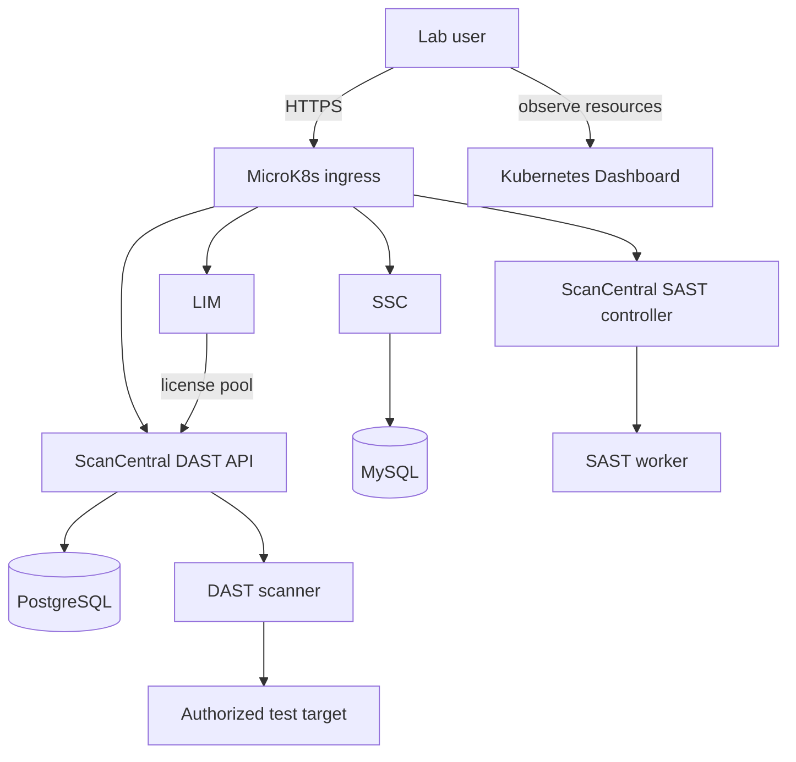
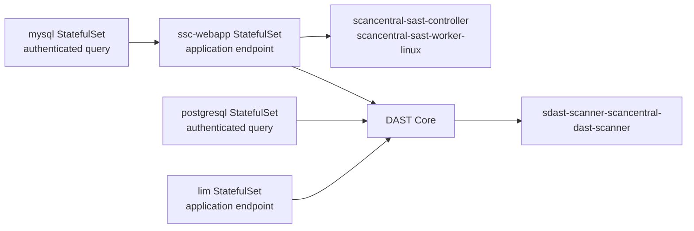
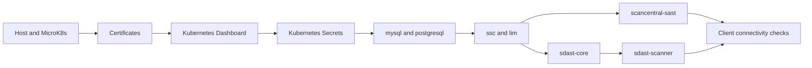
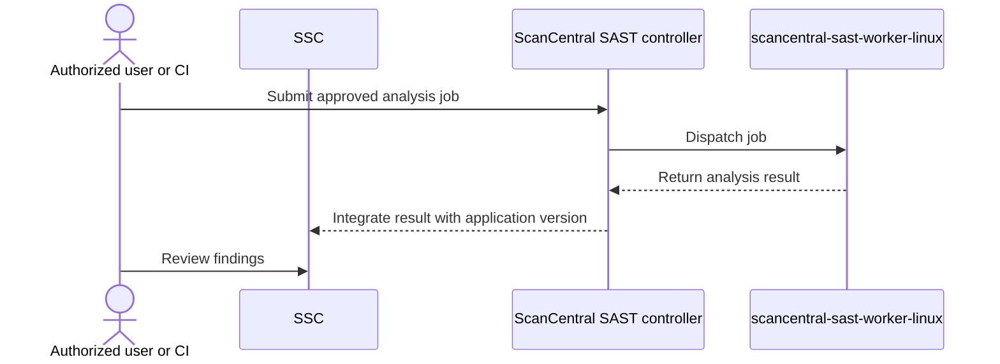
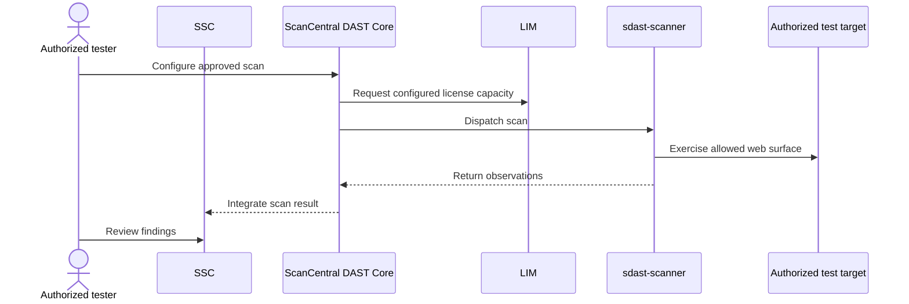
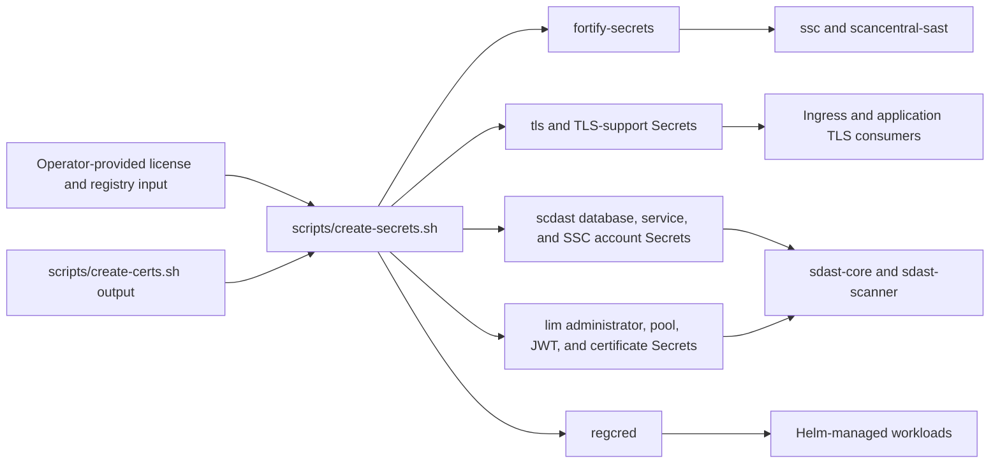
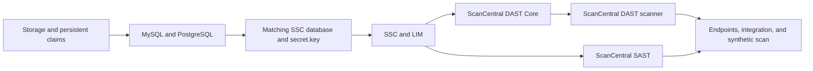

# Architecture and workflow diagrams

These diagrams describe the single-node lab assembled by this repository. They
are learning and troubleshooting aids, not a production reference
architecture. Labels that use monospace names are the Helm releases,
StatefulSets, or Kubernetes Secrets used by the current scripts.

!!! warning "Lab and demo use only"

    Use synthetic data and authorized scan targets. The diagrams deliberately
    contain no credentials, license contents, private addresses, or customer
    data.

## Lab topology

**Text alternative.** A lab user reaches SSC, the ScanCentral SAST controller,
LIM, and the ScanCentral DAST API through MicroK8s ingress and observes cluster
resources through Kubernetes Dashboard. SSC stores data in MySQL. DAST stores
operational data in PostgreSQL and uses LIM licensing. The SAST controller
coordinates a SAST worker, while DAST coordinates a scanner that accesses only
an authorized test target.

## Enforced startup dependencies

Solid arrows below mean a readiness gate implemented by
`scripts/lib/dependency-health.sh` and invoked by a component start script.

**Text alternative.** MySQL readiness, including an authenticated query, gates
SSC. SSC StatefulSet and endpoint readiness gate ScanCentral SAST. PostgreSQL,
SSC, and LIM readiness all gate DAST Core. DAST Core workload and endpoint
readiness gate the DAST scanner. DAST Core readiness specifically checks the
`sdast-core-scancentral-dast-core-api`,
`sdast-core-scancentral-dast-core-globalservice`, and
`sdast-core-scancentral-dast-core-utilityservice` StatefulSets.

## Deployment order

**Text alternative.** Prepare the host and MicroK8s first, followed by
certificates, Kubernetes Dashboard, and Kubernetes Secrets. Deploy the `mysql`
and `postgresql` releases before `ssc` and `lim`. Deploy `scancentral-sast`
after SSC is ready. Deploy `sdast-core` after PostgreSQL, SSC, and LIM are
ready, then deploy `sdast-scanner`. Finish with client connectivity checks.

## Static analysis flow

**Text alternative.** An authorized user or CI workflow submits an approved
analysis job to the ScanCentral SAST controller. The controller dispatches it
to the Linux worker, receives the analysis result, and integrates the result
with the relevant application version in SSC. The user reviews findings in
SSC. Authentication details are intentionally omitted.

## Dynamic analysis flow

**Text alternative.** An authorized tester configures a scan in ScanCentral
DAST Core. Core uses the configured LIM license capacity and dispatches work to
the `sdast-scanner`. The scanner exercises only the authorized target and
returns observations to Core. The integrated result is made available in SSC
for review. PostgreSQL persistence and service credentials are supporting
dependencies and are not shown in this interaction sequence.

## Secret material flow

Arrows show controlled materialization and consumption, not readable values.

**Text alternative.** Operator-provided license and registry inputs plus
certificate-generation output are consumed by `scripts/create-secrets.sh`.
That script materializes the shared `fortify-secrets`, TLS-related Secrets,
DAST database and service-account Secrets, LIM administrator/pool/JWT and
certificate Secrets, and the `regcred` image-pull Secret. Workloads consume
only the Secrets they require. Values must never be copied into Git,
diagnostics, diagrams, or command output.

## Recovery order

**Text alternative.** Recover storage and persistent claims before MySQL and
PostgreSQL. Restore SSC with its matching database and `secret.key`, then
recover SSC and LIM. Recover ScanCentral SAST and DAST Core next, followed by
the DAST scanner. Finally verify database queries, endpoints, integrations, and
an authorized synthetic scan. A snapshot is not recovery evidence until this
sequence has been tested.

For operational constraints, continue to [deployment and
lifecycle](../operations/deployment-and-lifecycle.md), [secrets and
licenses](../operations/secrets-and-licenses.md), and [backup and
recovery](../operations/backup-and-recovery.md).
