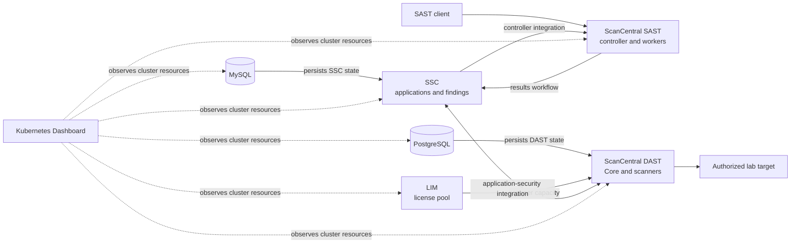

# Fortify Knowledge Center

Use this section to learn what the lab components do, who normally interacts
with them, and why deployment and recovery follow a particular order. This is
an orientation to the topology assembled by this repository, not a substitute
for the product documentation for the exact versions you deploy.

!!! warning "Lab and demo use only"

    This single-node environment is for evaluation, demonstrations, and
    training. Use synthetic data and authorized targets only. Do not use it as
    a production architecture.

## The system in one minute

[Software Security Center (SSC)](ssc.md) is the application-security system of
record in this lab: applications, versions, users, and the findings integrated
from Fortify scanning workflows belong there. The scanning systems do different
jobs:

- [ScanCentral SAST](scancentral-sast.md) distributes static analysis of
  approved source or build inputs and connects its workflow to SSC.
- [ScanCentral DAST](scancentral-dast.md) coordinates dynamic testing of a
  running, explicitly authorized web target and integrates with SSC.

The remaining services enable those workflows:

- [MySQL](mysql.md) persists SSC data.
- [PostgreSQL](postgresql.md) persists ScanCentral DAST operational data.
- [License and Infrastructure Manager (LIM)](lim.md) provides the DAST scanner
  license-pool service used by this lab.
- [Kubernetes Dashboard](kubernetes-dashboard.md) observes and administers
  Kubernetes resources. It is cluster tooling, not a Fortify product and not a
  findings interface.

## Dependencies and data flow

The critical paths are:

1. **MySQL → SSC → ScanCentral SAST.** MySQL must accept an authenticated
   query before SSC starts. SSC must answer before SAST starts, and SAST needs
   an SSC-created controller credential.
2. **MySQL → SSC → ScanCentral DAST, plus PostgreSQL and LIM → ScanCentral
   DAST.** DAST Core requires PostgreSQL for its own operational state and uses
   SSC integration; scanners require the configured LIM license pool. All three
   upstream services must be ready before the DAST workflow is ready.

An upstream outage can make several healthy-looking downstream pods unusable.
Diagnose from left to right rather than repeatedly restarting the consumer.

## Choose an interface

| Goal | Primary interface |
| --- | --- |
| Organize applications and review findings | SSC UI or supported SSC API |
| Submit and observe static-analysis work | Approved ScanCentral SAST client/workflow, with results in SSC |
| Configure and observe dynamic testing | ScanCentral DAST UI/API, with integrated findings in SSC |
| Configure DAST license capacity and pools | LIM UI/API |
| Inspect pods, events, and Kubernetes resources | Kubernetes Dashboard or `kubectl` |
| Inspect database internals | Operator diagnostics only; no learner-facing database UI is exposed |

The [offline Help Center](../help/README.md) provides concise versions of these
concepts from the terminal without a running cluster or internet connection.
Continue to [deployment](../deployment/index.md) when the dependency paths and
interface boundaries are clear.
