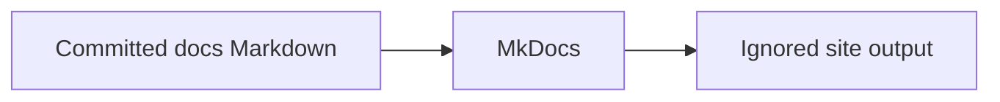

# Fortify Lab documentation

> **LAB / DEMO USE ONLY.** This repository is for evaluation, demonstrations,
> and training. It is not production deployment guidance. Never use production
> credentials, source code, customer data, or scan results in this lab.

This site is the version-controlled documentation for the Fortify lab deployment
toolkit. Choose the path that matches what you need:

- [Getting started](getting-started/index.md) takes a new operator from the
  lab-use boundary to the Python CLI/TUI entrypoint.
- [Fortify system](fortify/index.md) explains the applications, databases,
  dependencies, interfaces, and learning roles.
- [Deployment](deployment/index.md) covers lifecycle, networking, and TLS.
- [Operations](operations/README.md) covers routine lab operation, recovery,
  compatibility, and a first scan.
- [Configuration](configuration/index.md) points to the authoritative inputs,
  secret, license, URL, and version guidance.
- [Troubleshooting](troubleshooting/index.md) starts with symptoms and produces
  deliberately sanitized evidence.
- [Safety](safety/index.md) defines the lab/demo-only and data-handling boundary.
- [Contributing](contributing/index.md) explains how to change and validate the
  documentation.

The documentation site never reads or publishes runtime configuration,
credentials, licenses, private keys, generated secrets, or other operator input.
Its source is limited to committed Markdown beneath `docs/`.

## Preview locally

Create an isolated environment, install the pinned documentation dependencies,
and start the live-reloading server:

```bash
python3 -m venv .venv
.venv/bin/python -m pip install -r requirements-docs.txt
.venv/bin/mkdocs serve
```

Open <http://127.0.0.1:8000/>. The server is intended for local preview; do not
bind it to an externally reachable interface on a shared lab host.

## Run the strict build

```bash
.venv/bin/mkdocs build --strict
```

The generated site is written to the ignored `site/` directory. Strict mode
treats documentation warnings, including invalid internal references, as build
failures.

!!! note "One source of truth"

    The navigation groups authoritative pages by user intent. Existing paths
    remain stable for repository links and released wizard help; section landing
    pages point to those sources instead of copying their procedures.

=== "Preview"

    Use `mkdocs serve` while writing; saved pages reload automatically.

=== "Validate"

    Use `mkdocs build --strict` before committing documentation changes.


