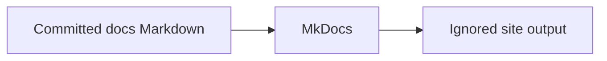

# Fortify Lab documentation

> **LAB / DEMO USE ONLY.** This repository is for evaluation, demonstrations,
> and training. It is not production deployment guidance. Never use production
> credentials, source code, customer data, or scan results in this lab.

This site is the version-controlled documentation for the Fortify lab deployment
toolkit. Start with the [lab-use boundary](lab-use.md), then use the existing
[operations guides](operations/README.md) to deploy, inspect, and troubleshoot
the lab safely.

The documentation site never reads or publishes runtime configuration,
credentials, licenses, private keys, generated secrets, or other operator input.
Its source is limited to committed Markdown beneath `docs/`.

## Preview locally

Create an isolated environment, install the pinned documentation dependencies,
and start the live-reloading server:

```bash
python3 -m venv .venv
.venv/bin/python -m pip install -r requirements-docs.txt
.venv/bin/mkdocs serve
```

Open <http://127.0.0.1:8000/>. The server is intended for local preview; do not
bind it to an externally reachable interface on a shared lab host.

## Run the strict build

```bash
.venv/bin/mkdocs build --strict
```

The generated site is written to the ignored `site/` directory. Strict mode
treats documentation warnings, including invalid internal references, as build
failures.

!!! note "Documentation scope"

    The current navigation exposes the repository's existing guides. A later
    milestone issue will reorganize and migrate the full information architecture.

=== "Preview"

    Use `mkdocs serve` while writing; saved pages reload automatically.

=== "Validate"

    Use `mkdocs build --strict` before committing documentation changes.


